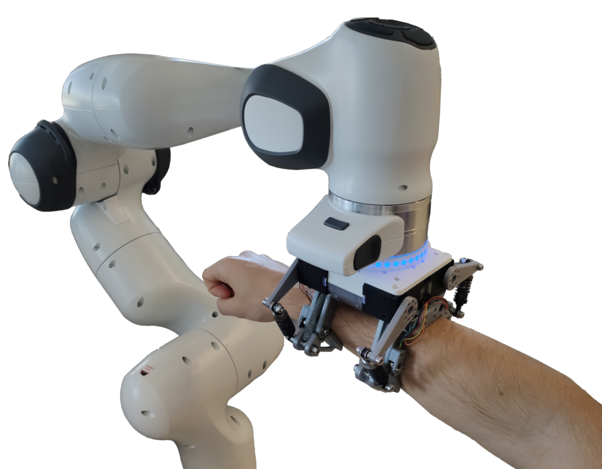
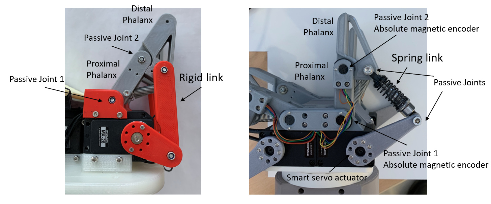

# pHRI-Hand-4F-Compliant

En este repositorio se encuentran los archivos relativos a la interacción fisica robot-humano. Por tanto, se encuentran ficheros de la garra subactuada de cuatro dedos con muelles en los eslabones

Overview of the gripper

Passive compliance

También se encuentran los codigos fuente del control compartido.
